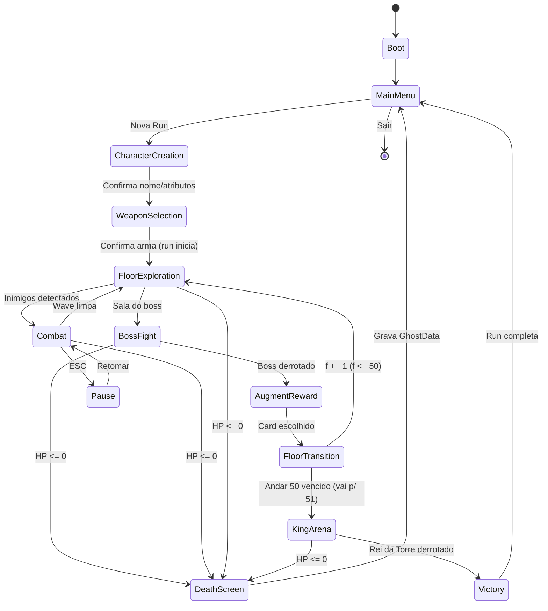

# A TORRE DA VINGANÇA — GDD & Arquitetura de Software
### Documento Técnico Fundacional (Roguelike 2D Retrô)

> **Working title:** *A Torre da Vingança* (Tower of Vengeance)
> **Gênero:** Roguelike de ação 2D, top-down ou side-scroller (à escolha)
> **Pilares de Design:** Permadeath significativo · Build aleatória (Augments) · Nemesis pessoal (Fantasma) · Escala incremental
> **Objetivo deste doc:** Servir de base canônica para implementação assistida por **Claude Code**. Tudo aqui é data-driven e modular por design.

---

## Sumário

- [Visão Geral & Stack Técnica](#0-visão-geral--stack-técnica)
- **PARTE 1 — Game Design (GDD)**
  - [1.1 Core Loop](#11-core-loop)
  - [1.2 Sistemas de Progressão & Escalonamento](#12-sistemas-de-progressão--escalonamento)
  - [1.3 Sistema de Augments](#13-sistema-de-augments)
  - [1.4 Mecânica do Fantasma (Nemesis System)](#14-mecânica-do-fantasma-nemesis-system)
- **PARTE 2 — Arquitetura de Software**
  - [2.1 Máquina de Estados (State Machine)](#21-máquina-de-estados-state-machine)
  - [2.2 Modelagem de Dados (JSON + Classes)](#22-modelagem-de-dados-json--classes)
  - [2.3 Estrutura de Pastas & Módulos](#23-estrutura-de-pastas--módulos)
  - [2.4 Roadmap de Implementação (5 Fases)](#24-roadmap-de-implementação-5-fases)
- [Apêndice A — Tabela Mestra de Constantes (`balance.json`)](#apêndice-a--tabela-mestra-de-constantes-balancejson)
- [Apêndice B — Glossário](#apêndice-b--glossário)

---

## 0. Visão Geral & Stack Técnica

### 0.1 Recomendação de Engine

A arquitetura abaixo separa **lógica pura** (Core/Domain, testável sem render) de **apresentação** (UI/Graphics). Isso a torna portável. A escolha de engine afeta só a camada de apresentação.

| Engine | Linguagem | Prós p/ este projeto | Contras | Veredito |
|---|---|---|---|---|
| **Godot 4** | GDScript | 2D de primeira, gratuito/aberto, cenas em texto (Claude Code edita fácil), tilemaps nativos | Comunidade menor que Unity | **★ Recomendado** |
| Unity | C# | Ecossistema enorme, asset store | Pesado, licenciamento volátil, projeto binário | Alternativa |
| Pygame / Python | Python | 100% código (ideal p/ Claude Code), zero "mágica" | Você reimplementa render/física/colisão | Alternativa minimalista |
| Phaser 3 | TypeScript | Web-first, ótimo p/ retrô, deploy fácil | Performance limitada em cenas densas | Alternativa web |

> **Decisão deste documento:** **Godot 4 + GDScript**. Os exemplos de classe usam sintaxe GDScript, mas todo modelo mapeia 1:1 para `@dataclass` (Python), `class` (C#/TS). A camada **Core não importa nada de render**, então pode ser portada inteira.

### 0.2 Princípios de Arquitetura (não-negociáveis)

1. **Data-Driven:** armas, inimigos, augments e andares são definidos em **JSON** em `data/`, nunca hardcoded. Designer mexe sem tocar código.
2. **Core puro:** combate, progressão, RNG e lógica do fantasma vivem em `src/core/` e **não dependem da engine**. São cobertos por testes unitários.
3. **Determinismo via seed:** todo RNG passa por um `RNGService` semeado. Mesma seed → mesma run. Essencial para debug, balanceamento e replays do fantasma.
4. **Eventos sobre acoplamento:** sistemas conversam por um `EventBus` (sinais), não por referências diretas. UI escuta o Core, nunca o contrário.

---

# PARTE 1 — Game Design (GDD)

## 1.1 Core Loop

O jogo tem **três loops aninhados**. Dominar essa hierarquia é o que organiza todo o código.

```
┌─────────────────────────────────────────────────────────────────┐
│ META-LOOP (entre runs · persiste em disco)                       │
│   Permadeath ──► grava GhostData ──► nova run encontra o Nemesis  │
│        ▲                                                   │       │
│        └───────────────────── (morrer) ◄──────────────────┘       │
│                                                                   │
│   ┌─────────────────────────────────────────────────────────┐    │
│   │ MACRO-LOOP (uma run · em memória)                        │    │
│   │   Criar Personagem ──► Escolher Arma ──► [MICRO-LOOP]    │    │
│   │        ──► Subir andar ──► ... ──► Andar 51 (Rei) = WIN  │    │
│   │                                                          │    │
│   │   ┌──────────────────────────────────────────────────┐  │    │
│   │   │ MICRO-LOOP (um andar · gameplay segundo-a-segundo)│  │    │
│   │   │   Entrar ►► Combate (waves) ►► Boss do Andar      │  │    │
│   │   │      ►► Escolher 1 de 3 Cards (Augment) ►► Subir  │  │    │
│   │   └──────────────────────────────────────────────────┘  │    │
│   └─────────────────────────────────────────────────────────┘    │
└─────────────────────────────────────────────────────────────────┘
```

### Detalhamento do Micro-Loop (o coração do gameplay)

| Fase | Evento | Estado da Máquina | Saída |
|---|---|---|---|
| 1. Entrada | Spawna no andar `f`, layout gerado/escolhido | `FLOOR_EXPLORATION` | — |
| 2. Combate | N waves de inimigos comuns (escala por `f`) | `COMBAT` | XP + ouro |
| 3. Boss | Boss Normal (ou Great Boss em 10/20/30/40/50) | `BOSS_FIGHT` | XP + ouro + drop garantido |
| 3.5 Nemesis | *Se há fantasma deste andar:* boss invoca o Fantasma a 60% HP | `BOSS_FIGHT` (sub-fase) | Buff de Vingança ao vencer |
| 4. Recompensa | Sorteia 3 cards; jogador escolhe 1 | `AUGMENT_REWARD` | Augment aplicado / arma upada |
| 5. Avanço | Sobe escada → `f += 1`, dificuldade recalculada | `FLOOR_TRANSITION` | Volta à Fase 1 |

**Gatilho de saída do loop:** morte (`current_hp <= 0` → `DEATH_SCREEN`) **ou** vitória no andar 51 (`VICTORY`).

---

## 1.2 Sistemas de Progressão & Escalonamento

A tensão central do jogo nasce de uma assimetria proposital:

> **Inimigos crescem de forma GEOMÉTRICA "de graça".**
> **O jogador cresce LINEARMENTE de base, e só alcança a curva geométrica através de boas escolhas de Augments e upgrades de arma.**

Resultado: jogadores habilidosos que constroem sinergias **ultrapassam** a curva; builds fracas **ficam para trás** e morrem. A dificuldade não é um número fixo — é a distância entre as duas curvas.

### 1.2.1 Curva dos Inimigos (geométrica)

Toda stat de inimigo deriva da fórmula base por andar, multiplicada por um modificador de Rank.

```
ENEMY_HP(f)   = BASE_HP  * (GROWTH_HP  ^ (f - 1))
ENEMY_ATK(f)  = BASE_ATK * (GROWTH_ATK ^ (f - 1))
ENEMY_DEF(f)  = BASE_DEF * (GROWTH_DEF ^ (f - 1))
```

Constantes recomendadas (em `balance.json`, fáceis de tunar):

| Constante | Valor | Justificativa |
|---|---|---|
| `BASE_HP` | 40 | HP de um inimigo comum no andar 1 |
| `BASE_ATK` | 8 | Dano por golpe no andar 1 |
| `GROWTH_HP` | **1.090** | +9%/andar → ~59× no andar 50 |
| `GROWTH_ATK` | **1.070** | +7%/andar (ataque cresce mais devagar → lutas duram mais, evita one-shots) |
| `GROWTH_DEF` | 1.050 | Defesa cresce devagar p/ não anular o dano do jogador |

**Modificadores de Rank** (multiplicam o resultado acima):

| Rank | × HP | × ATK | Comportamento |
|---|---|---|---|
| `MINION` | 0.5 | 0.7 | Trash mob, morre rápido |
| `NORMAL` | 1.0 | 1.0 | Baseline |
| `ELITE` | 2.5 | 1.4 | Mini-ameaça, dropa melhor |
| `BOSS` (andar comum) | 6.0 | 1.6 | Boss do andar |
| `GREAT_BOSS` (10/20/30/40/50) | 12.0 | 2.0 | Pico de dificuldade + fases |
| `KING` (andar 51) | 30.0 | 3.0 | Boss final, múltiplas fases |

Exemplo de HP de um inimigo `NORMAL` ao longo da torre:

| Andar | Multiplicador (`1.09^(f-1)`) | HP (`40 ×`) |
|---|---|---|
| 1 | 1.00 | 40 |
| 10 | 2.17 | 87 |
| 25 | 7.91 | 316 |
| 40 | 28.8 | 1.153 |
| 50 | 59.1 | 2.364 |

### 1.2.2 Curva do Jogador (linear de base + multiplicadores ganhos)

O jogador sobe de nível ao limpar andares (≈ 1 nível/andar no início). As stats base crescem **linearmente**:

```
PLAYER_MAX_HP(lvl) = BASE_PHP  + (lvl - 1) * HP_PER_LEVEL
PLAYER_ATK(lvl)    = BASE_PATK + (lvl - 1) * ATK_PER_LEVEL   # atributo "força", multiplica a arma
```

| Constante | Valor |
|---|---|
| `BASE_PHP` | 120 |
| `HP_PER_LEVEL` | 14 |
| `BASE_PATK` | 5 |
| `ATK_PER_LEVEL` | 2 |

O **salto geométrico** que mantém o jogador competitivo vem de duas fontes multiplicativas:

**A) Arma (geométrica, sobe via Augments de arma / altares):**
```
WEAPON_DAMAGE(wlvl) = BASE_WDMG * (WEAPON_GROWTH ^ (wlvl - 1))
```
`BASE_WDMG = 15`, `WEAPON_GROWTH = 1.12` (+12% por nível de arma).

**B) Augments percentuais** (somam multiplicadores; ver 1.3).

### 1.2.3 Fórmula Mestra de DPS e EHP

Tudo converge nestas duas equações — implemente-as no `CombatResolver` e o balanceamento fica centralizado:

```
# Dano por golpe
HIT_DAMAGE = (PLAYER_ATK(lvl) + WEAPON_DAMAGE(wlvl))
           * (1 + Σ augment_%damage)
           * (1 - target_damage_reduction)

# DPS efetivo (com crítico e cadência)
DPS = HIT_DAMAGE
    * attack_speed
    * (1 + crit_chance * (crit_damage - 1))

# HP Efetivo (quanto dano o jogador aguenta de fato)
EHP = max_hp / (1 - damage_reduction)
```

### 1.2.4 Alvo de Balanceamento ("a banda")

Não persiga números absolutos; persiga **razões**. Defina dois TTKs (*Time To Kill*):

```
TTK_inimigo  = ENEMY_HP / PLAYER_DPS      # quanto tempo p/ o jogador matar
TTK_jogador  = PLAYER_EHP / ENEMY_DPS     # quanto tempo p/ o inimigo matar o jogador
```

| Encontro | `TTK_inimigo` alvo | `TTK_jogador` alvo |
|---|---|---|
| Inimigo `NORMAL` | 1,5 – 3,5 s | 18 – 30 s |
| `ELITE` | 4 – 8 s | 12 – 20 s |
| `BOSS` | 20 – 45 s | 10 – 18 s |
| `GREAT_BOSS` | 45 – 90 s | 8 – 14 s |

> **Heurística de tuning:** crie um script de simulação (`tests/sim_balance.py` ou `.gd`) que, para cada andar, monta um jogador "mediano" (nível ≈ andar, arma upada N vezes, M augments médios) e calcula os TTKs. Se saírem da banda, ajuste **uma** constante em `balance.json` e re-rode. Isso é metade do trabalho do roguelike.

---

## 1.3 Sistema de Augments

Ao vencer o boss do andar, sorteie **3 cards**; o jogador escolhe **1**. O sorteio é ponderado por `weight` e enviesado pelo atributo `luck` do jogador (luck aumenta a chance de tiers raros).

### 1.3.1 Os 3 Tiers

| Tier | Nome | Raridade | Magnitude do efeito | `weight` base | Cor (UI retrô) |
|---|---|---|---|---|---|
| 1 | **Fragmento** | Comum | Pequena (+5–10%) | 100 | Cinza/Branco |
| 2 | **Relíquia** | Raro | Média (+15–30%) ou efeito novo | 30 | Azul/Roxo |
| 3 | **Artefato** | Épico | Grande (mecânica nova / transformação) | 6 | Dourado/Vermelho |

Fórmula de chance de cada tier no sorteio:
```
chance(tier) = weight(tier) * (1 + luck * LUCK_RARITY_FACTOR_por_tier)
# normalizado sobre a soma. LUCK_RARITY_FACTOR maior nos tiers altos.
```

### 1.3.2 Categorias e Operações

Cada Augment aplica **efeitos** com uma `operation` sobre uma `stat`. Padronizar isso permite empilhamento e exibição automáticos.

| Categoria | Exemplos |
|---|---|
| `OFFENSE` | +% dano, +crit, +cadência, projétil perfurante |
| `DEFENSE` | +max HP, +armadura, escudo regenerativo, esquiva |
| `UTILITY` | +luck, +velocidade, cura ao subir andar, +ouro |
| `WEAPON` | **+1 nível de arma**, novo modificador (vampirismo, elemental, ricochete) |

| `operation` | Significado | Ordem de aplicação |
|---|---|---|
| `ADD` | soma flat (`+10` armadura) | 1º |
| `PCT_ADD` | soma ao multiplicador (`+15%` → fator 1.15) | 2º (somados entre si) |
| `MULT` | multiplica direto (`×1.2`, raro/Artefato) | 3º (multiplicam-se) |
| `SET` | define valor / liga flag (`pierce = true`) | flags |

> **Regra de empilhamento:** `final = ((base + ΣADD) * (1 + ΣPCT_ADD)) * ΠMULT`. Isso evita explosão de poder (PCT_ADD soma, não multiplica) e reserva o multiplicativo puro para Artefatos.

Augments podem ser `stackable` com `max_stacks`. Artefatos geralmente são únicos (`stackable: false`).

---

## 1.4 Mecânica do Fantasma (Nemesis System)

A assinatura do jogo. Onde você morre, deixa um **Fantasma**. Na próxima run, ao chegar no **boss daquele mesmo andar**, o boss o invoca para lutar ao seu lado.

### 1.4.1 O Problema de Design (e por que importa)

Como o fantasma é uma run **anterior**, há risco de duas falhas:

- **Impossível:** sua run passada estava forte; a atual está fraca → o fantasma vira um juggernaut e, somado ao boss, é 2-contra-1 injusto.
- **Irrelevante:** o fantasma é um clone exato seu, mas IA burra → trivial.

A solução é tratar o fantasma como um **add de elite nerfado**, não como um clone, e **ancorá-lo ao mesmo andar** (você o reencontra com progressão comparável à que tinha).

### 1.4.2 As Regras Matemáticas

**Regra 1 — Coeficiente Nemesis (nerf base).** O fantasma herda stats da run anterior multiplicadas por um coeficiente < 1:

```
GHOST_STAT(s) = SNAPSHOT_STAT(s) * NEMESIS_COEFF
NEMESIS_COEFF = 0.65   # tunável: 0.5 = fácil, 0.8 = hardcore
```

**Regra 2 — Teto relativo ao jogador atual (anti-impossível).** O HP do fantasma nunca passa de um múltiplo do SEU HP atual:

```
GHOST_HP = min( SNAPSHOT_HP * NEMESIS_COEFF , CURRENT_PLAYER_HP * GHOST_HP_CAP )
GHOST_HP_CAP = 2.0
```
Assim, mesmo vindo de uma run lendária, o fantasma tem no máximo ~2× o seu HP atual — sempre derrotável.

**Regra 3 — Herança parcial de Augments (kit focado).** O fantasma não recebe todos os augments — apenas um subconjunto priorizado:

```
n_augments_herdados = clamp( floor(death_floor / 3), 1, 5 )
# Seleciona priorizando tier: Artefatos > Relíquias > Fragmentos, até n.
```
No máximo 5 augments, priorizando os mais impactantes. Evita um fantasma com 30 sinergias.

**Regra 4 — IA simplificada (é um eco, não você).** O fantasma:
- usa apenas o **ataque básico** da arma herdada + **no máximo 1** habilidade ativa (o special de maior tier);
- **não** tem augments reativos, esquiva ativa, nem timing perfeito;
- segue um `ai_profile = "echo"` previsível (persegue + ataca em janelas fixas).

**Regra 5 — Timing de invocação.** O boss invoca o fantasma **uma vez**, ao cruzar um limiar de HP:
```
boss_hp_pct <= GHOST_SUMMON_THRESHOLD   # ex.: 0.60
```
O fantasma entra com barra de HP própria. Derrotá-lo não é obrigatório para matar o boss, mas ele continua atacando até cair.

### 1.4.3 Recompensa de Catarse ("Buff de Vingança")

Derrotar seu próprio fantasma é o ápice temático (você supera seu fracasso). Recompense:

```
Ao matar o Fantasma:
  - cura 25% do max HP imediatamente (alívio mecânico no meio da luta de boss);
  - concede 1 Augment garantido de tier Relíquia (ou superior) na recompensa do andar;
  - aplica "Vingança" (buff temporário: +20% dano até o fim do andar).
```

### 1.4.4 Ciclo de Vida do Fantasma

| Evento | Efeito no `GhostData` (em disco) |
|---|---|
| Jogador morre no andar `f` | Cria/atualiza `GhostData` (`death_floor = f`, snapshot completo), `defeated = false` |
| Nova run chega ao boss do andar `f` | Carrega `GhostData`; boss o invoca |
| Jogador derrota o fantasma | `defeated = true` (não some — fica como troféu/registro) |
| Jogador morre de novo (qualquer andar) | **Sobrescreve** o fantasma ativo (você sempre enfrenta seu fracasso *mais recente*) |
| Primeira run de todas | Sem `GhostData` → boss luta normalmente (degradação graciosa) |

> **Variante Hardcore (opcional, flag em config):** mantenha um "Cemitério" com os **3 fantasmas mais recentes**; o boss invoca todos. Excelente knob de dificuldade pós-game.

---

# PARTE 2 — Arquitetura de Software

## 2.1 Máquina de Estados (State Machine)

Padrão recomendado: **Stack-based FSM** (estados podem ser empilhados — ex.: `PAUSE` sobre `COMBAT` sem perder contexto). Um `StateMachine` central faz `push`/`pop`/`change`. Cada estado expõe `enter()`, `exit()`, `update(dt)`, `handle_input()`.



### Tabela de Transições (fonte da verdade para implementação)

| Estado | Entradas válidas | Transições de saída | Responsabilidade principal |
|---|---|---|---|
| `Boot` | — | → `MainMenu` | Carregar `data/`, `SaveService`, `GhostRepository` |
| `MainMenu` | input UI | → `CharacterCreation` / quit | Menu, continuar, opções |
| `CharacterCreation` | input UI | → `WeaponSelection` | Nome + distribuição inicial de atributos |
| `WeaponSelection` | input UI | → `FloorExploration` | Escolher arma do arsenal; **inicia `RunState`** |
| `FloorExploration` | gameplay | → `Combat` / `BossFight` / `DeathScreen` | Movimento, layout do andar, navegação |
| `Combat` | gameplay | → `FloorExploration` / `DeathScreen` / `Pause` | Resolver waves de inimigos comuns |
| `BossFight` | gameplay | → `AugmentReward` / `DeathScreen` | Boss + sub-fase de invocação do Fantasma |
| `AugmentReward` | input UI | → `FloorTransition` | Sortear 3 cards, aplicar escolha |
| `FloorTransition` | — | → `FloorExploration` / `KingArena` | `f += 1`, recalcular escala, autosave da run |
| `KingArena` | gameplay | → `Victory` / `DeathScreen` | Boss final multi-fase |
| `DeathScreen` | input UI | → `MainMenu` | **Gravar `GhostData`**, mostrar stats da run |
| `Victory` | input UI | → `MainMenu` | Tela de vitória / créditos |
| `Pause` | input UI | → estado anterior (pop) | Overlay, não destrói o estado abaixo |

```gdscript
# src/states/state_machine.gd
class_name StateMachine
extends RefCounted

var _stack: Array[GameState] = []
signal state_changed(name: String)

func change(state: GameState) -> void:   # troca o topo
    if not _stack.is_empty():
        _stack.back().exit()
        _stack.pop_back()
    push(state)

func push(state: GameState) -> void:      # empilha (ex.: Pause)
    _stack.push_back(state)
    state.enter()
    state_changed.emit(state.name)

func pop() -> void:                       # volta ao anterior
    if not _stack.is_empty():
        _stack.back().exit()
        _stack.pop_back()
    if not _stack.is_empty():
        state_changed.emit(_stack.back().name)

func update(dt: float) -> void:
    if not _stack.is_empty():
        _stack.back().update(dt)
```

---

## 2.2 Modelagem de Dados (JSON + Classes)

Convenção: **JSON em `data/`** = definição estática (designer). **Classe em `src/core/entities/`** = instância em runtime, hidratada do JSON. Mostro os dois para cada entidade.

### 2.2.1 `Player`

```jsonc
// Instância em runtime (salva no autosave da run)
{
  "id": "uuid-v4",
  "name": "Kael",
  "level": 1,
  "experience": 0,
  "xp_to_next": 100,
  "stats": {
    "max_hp": 120, "current_hp": 120,
    "attack": 5, "defense": 0,
    "crit_chance": 0.05, "crit_damage": 1.5,
    "attack_speed": 1.0, "move_speed": 110,
    "damage_reduction": 0.0, "lifesteal": 0.0,
    "luck": 0
  },
  "weapon": { /* objeto Weapon, ver 2.2.2 */ },
  "augments": ["aug_vampiric_frag", "aug_iron_skin_relic"],
  "gold": 0,
  "current_floor": 1,
  "run_id": "uuid-v4"
}
```

```gdscript
# src/core/entities/player.gd
class_name Player
extends RefCounted

var id: String
var name: String
var level: int = 1
var experience: int = 0
var xp_to_next: int = 100
var stats: StatBlock                       # ver 2.2.6
var weapon: Weapon
var augments: Array[Augment] = []
var gold: int = 0
var current_floor: int = 1
var run_id: String

func take_damage(amount: int) -> void:
    var dealt := int(amount * (1.0 - stats.damage_reduction))
    stats.current_hp -= dealt
    if stats.current_hp <= 0:
        EventBus.player_died.emit(self)

func gain_xp(amount: int) -> void:
    experience += amount
    while experience >= xp_to_next:
        experience -= xp_to_next
        _level_up()

func snapshot() -> Dictionary:             # usado p/ gerar GhostData
    return { "level": level, "stats": stats.to_dict(),
             "weapon": weapon.to_dict(),
             "augments": augments.map(func(a): return a.id) }
```

### 2.2.2 `Weapon`

```jsonc
// data/weapons/sword_of_mourning.json (definição do arsenal)
{
  "id": "wpn_sword_mourning",
  "name": "Lâmina do Luto",
  "type": "MELEE_SWORD",          // MELEE_SWORD | SPEAR | DAGGER | BOW | STAFF | HAMMER
  "level": 1,
  "base_damage": 15,
  "weapon_growth": 1.12,           // multiplicador por nível de arma
  "attack_range": 55,
  "attack_speed": 1.2,
  "crit_bonus": 0.0,
  "modifiers": [],                 // efeitos especiais acumulados via Augments
  "special_ability": {
    "id": "abil_whirlwind",
    "name": "Redemoinho",
    "cooldown": 8.0,
    "effect": { "type": "AOE_DAMAGE", "radius": 90, "mult": 2.0 }
  }
}
```

```gdscript
# src/core/entities/weapon.gd
class_name Weapon
extends RefCounted

var id: String
var name: String
var type: String
var level: int = 1
var base_damage: int
var weapon_growth: float = 1.12
var attack_range: float
var attack_speed: float
var modifiers: Array[WeaponModifier] = []   # ex.: pierce, lifesteal, elemental
var special_ability: SpecialAbility

func current_damage() -> float:
    return base_damage * pow(weapon_growth, level - 1)

func upgrade() -> void:
    level += 1
    EventBus.weapon_upgraded.emit(self)
```

### 2.2.3 `Augment`

```jsonc
// data/augments/vampiric_fragment.json
{
  "id": "aug_vampiric_frag",
  "name": "Sede de Sangue",
  "tier": "FRAGMENT",              // FRAGMENT | RELIC | ARTIFACT
  "category": "OFFENSE",           // OFFENSE | DEFENSE | UTILITY | WEAPON
  "description": "Cura 3% do dano causado.",
  "weight": 100,                   // peso no sorteio
  "stackable": true,
  "max_stacks": 5,
  "effects": [
    { "stat": "lifesteal", "operation": "PCT_ADD", "value": 0.03 }
  ]
}
```

```jsonc
// Exemplo de Artefato (mecânica transformadora)
{
  "id": "aug_glass_cannon_artifact",
  "name": "Canhão de Vidro",
  "tier": "ARTIFACT",
  "category": "OFFENSE",
  "description": "Dobra seu dano, mas seu HP máximo é reduzido pela metade.",
  "weight": 6,
  "stackable": false,
  "effects": [
    { "stat": "damage_mult", "operation": "MULT", "value": 2.0 },
    { "stat": "max_hp",      "operation": "MULT", "value": 0.5 }
  ]
}
```

```gdscript
# src/core/entities/augment.gd
class_name Augment
extends RefCounted

enum Tier { FRAGMENT, RELIC, ARTIFACT }
enum Category { OFFENSE, DEFENSE, UTILITY, WEAPON }

var id: String
var name: String
var tier: Tier
var category: Category
var description: String
var weight: int
var stackable: bool
var max_stacks: int
var effects: Array[AugmentEffect] = []   # { stat, operation, value }

func apply_to(target: Player) -> void:
    for e in effects:
        StatResolver.apply(target.stats, e)   # respeita ADD < PCT_ADD < MULT
```

### 2.2.4 `Enemy` / `Boss`

```jsonc
// data/enemies/skeleton_warrior.json
{
  "id": "enm_skeleton",
  "name": "Esqueleto Guerreiro",
  "archetype": "MELEE",            // MELEE | RANGED | CASTER | TANK
  "rank": "NORMAL",                // MINION | NORMAL | ELITE | BOSS | GREAT_BOSS | KING
  "base_stats": { "max_hp": 40, "attack": 8, "defense": 2, "move_speed": 80 },
  "ai_profile": "aggressive",
  "abilities": ["abil_basic_slash"],
  "loot": { "gold_min": 4, "gold_max": 10, "xp": 12 },
  "spawn_floors": [1, 15],         // intervalo de andares onde aparece
  "sprite": "skeleton_warrior"
}
```

```jsonc
// data/bosses/legion_brute.json — Boss extends Enemy (+ fases, +invocação)
{
  "id": "bss_legion_brute",
  "name": "Bruto da Legião",
  "archetype": "TANK",
  "rank": "GREAT_BOSS",
  "base_stats": { "max_hp": 40, "attack": 8, "defense": 4, "move_speed": 60 },
  "ai_profile": "boss_phased",
  "abilities": ["abil_ground_slam", "abil_charge", "abil_enrage"],
  "phases": [
    { "hp_threshold": 0.60, "on_enter": ["summon_ghost"] },
    { "hp_threshold": 0.30, "on_enter": ["abil_enrage"], "atk_mult": 1.4 }
  ],
  "can_summon_ghost": true,
  "ghost_summon_threshold": 0.60,
  "intro_dialogue": "Sua família implorou. Você fará o mesmo.",
  "loot": { "gold_min": 80, "gold_max": 150, "xp": 300,
            "guaranteed_drop_tier": "RELIC" }
}
```

```gdscript
# src/core/entities/enemy.gd
class_name Enemy
extends RefCounted

var id: String
var name: String
var archetype: String
var rank: String
var stats: StatBlock        # já ESCALADO pelo andar na criação (ver factory)
var ai_profile: String
var abilities: Array[String]

# src/core/entities/boss.gd
class_name Boss
extends Enemy

var phases: Array[BossPhase] = []
var can_summon_ghost: bool = false
var ghost_summon_threshold: float = 0.6
var _summoned: bool = false

func on_damaged() -> void:
    var pct := float(stats.current_hp) / float(stats.max_hp)
    if can_summon_ghost and not _summoned and pct <= ghost_summon_threshold:
        _summoned = true
        EventBus.summon_ghost_requested.emit(current_floor)
    for phase in phases:
        phase.check_and_trigger(pct, self)
```

### 2.2.5 `GhostData` (persistente — sobrevive ao permadeath)

Esta é a única entidade que vive **fora** da run, em `user://saves/ghosts.json` (Godot) ou equivalente.

```jsonc
// user://saves/ghosts.json
{
  "active_ghost": {
    "ghost_id": "uuid-v4",
    "origin_run_id": "uuid-v4",
    "death_floor": 25,
    "timestamp": "2026-06-27T14:03:00Z",
    "nemesis_coeff": 0.65,
    "defeated": false,
    "player_snapshot": {
      "name": "Kael",
      "level": 22,
      "stats": { "max_hp": 428, "attack": 49, "defense": 31, "crit_chance": 0.22 },
      "weapon": { "id": "wpn_sword_mourning", "level": 9 },
      "augments": ["aug_glass_cannon_artifact", "aug_vampiric_frag",
                   "aug_iron_skin_relic", "aug_swift_frag", "aug_crit_relic"]
    }
  },
  "graveyard": []   // variante hardcore: até 3 fantasmas
}
```

```gdscript
# src/core/ghost/ghost_data.gd
class_name GhostData
extends RefCounted

var ghost_id: String
var origin_run_id: String
var death_floor: int
var timestamp: String
var nemesis_coeff: float = 0.65
var defeated: bool = false
var player_snapshot: Dictionary

# src/core/ghost/ghost_factory.gd — converte GhostData em um Enemy jogável
class_name GhostFactory
extends RefCounted

static func build(data: GhostData, current_player: Player) -> Enemy:
    var snap := data.player_snapshot
    var ghost := Enemy.new()
    ghost.name = "%s (Eco)" % snap["name"]
    ghost.archetype = "ECHO"
    ghost.rank = "ELITE"
    ghost.ai_profile = "echo"

    var s := StatBlock.new()
    # Regra 1: coeficiente; Regra 2: teto relativo ao jogador atual
    var capped_hp: float = min(
        snap["stats"]["max_hp"] * data.nemesis_coeff,
        current_player.stats.max_hp * BalanceConfig.GHOST_HP_CAP)
    s.max_hp     = int(capped_hp)
    s.current_hp = s.max_hp
    s.attack     = int(snap["stats"]["attack"] * data.nemesis_coeff)
    s.defense    = int(snap["stats"]["defense"] * data.nemesis_coeff)
    ghost.stats  = s

    # Regra 3: herda só os augments mais fortes (até 5)
    ghost.abilities = _inherit_top_augments(snap["augments"], data.death_floor)
    return ghost
```

### 2.2.6 Tipos de Suporte (`StatBlock`, `Effect`, `Phase`)

```gdscript
# src/core/entities/stat_block.gd — bloco de stats reutilizado por Player/Enemy
class_name StatBlock
extends RefCounted
var max_hp: int; var current_hp: int
var attack: int; var defense: int
var crit_chance: float = 0.0; var crit_damage: float = 1.5
var attack_speed: float = 1.0; var move_speed: float = 100.0
var damage_reduction: float = 0.0; var lifesteal: float = 0.0
var luck: int = 0
func to_dict() -> Dictionary: return inst_to_dict(self)

# AugmentEffect: { stat: String, operation: ADD|PCT_ADD|MULT|SET, value: float }
# BossPhase:     { hp_threshold: float, on_enter: Array[String], atk_mult: float }
```

---

## 2.3 Estrutura de Pastas & Módulos

Árvore modular com **separação rígida Core ↔ Apresentação**. O diretório `src/core/` não importa nada de `presentation/` nem da engine de render.

```
torre-da-vinganca/
├── project.godot                  # (ou pyproject.toml / package.json)
├── README.md
│
├── data/                          # ◄ DATA-DRIVEN: tudo editável sem código
│   ├── weapons/                   #   *.json do arsenal
│   ├── augments/                  #   *.json (organizados por tier em subpastas se quiser)
│   ├── enemies/                   #   *.json de inimigos comuns
│   ├── bosses/                    #   *.json de bosses e great bosses
│   ├── floors/                    #   layout/regras por andar (waves, pool de inimigos)
│   └── balance.json               #   ◄ TODAS as constantes de tuning (Apêndice A)
│
├── src/
│   ├── core/                      # ◄ LÓGICA PURA · sem render · 100% testável
│   │   ├── entities/              #   player.gd, weapon.gd, enemy.gd, boss.gd,
│   │   │                          #   augment.gd, stat_block.gd
│   │   ├── combat/                #   combat_resolver.gd (HIT_DAMAGE/DPS), hit_box.gd
│   │   ├── progression/           #   leveling.gd, scaling.gd (curvas de andar)
│   │   ├── augments/              #   augment_pool.gd (sorteio ponderado), stat_resolver.gd
│   │   ├── ghost/                 #   ghost_data.gd, ghost_factory.gd, nemesis_rules.gd
│   │   └── run/                   #   run_state.gd, floor_manager.gd, wave_spawner.gd
│   │
│   ├── data_layer/                # ◄ Carrega/valida JSON → objetos do Core
│   │   ├── json_loader.gd
│   │   ├── weapon_repository.gd
│   │   ├── enemy_repository.gd
│   │   ├── augment_repository.gd
│   │   └── ghost_repository.gd    #   persiste/recupera GhostData (read/write disco)
│   │
│   ├── states/                    # ◄ Máquina de Estados (cola Core ↔ telas)
│   │   ├── state_machine.gd
│   │   ├── game_state.gd          #   classe base (enter/exit/update)
│   │   └── states/                #   main_menu_state.gd, combat_state.gd,
│   │                              #   boss_fight_state.gd, augment_reward_state.gd,
│   │                              #   death_state.gd, ... (1 arquivo por estado)
│   │
│   ├── presentation/              # ◄ RENDER · UI · input · cenas (depende da engine)
│   │   ├── scenes/                #   .tscn dos andares, arena do rei, menus
│   │   ├── ui/                    #   hud.gd, card_select.gd, health_bar.gd
│   │   ├── entities/              #   player_view.gd, enemy_view.gd (sprite+anim)
│   │   └── effects/               #   particles, screen shake, hit flash
│   │
│   ├── services/                  # ◄ Infra transversal (singletons/autoload)
│   │   ├── event_bus.gd           #   sinais globais (Core emite, UI escuta)
│   │   ├── rng_service.gd         #   RNG semeado e determinístico
│   │   ├── save_service.gd        #   autosave da run + saves de meta
│   │   ├── audio_service.gd
│   │   └── balance_config.gd      #   carrega balance.json em constantes tipadas
│   │
│   └── autoload/
│       └── game_manager.gd        #   bootstrap; instancia StateMachine e serviços
│
├── assets/
│   ├── sprites/                   #   pixel art (player, inimigos, tilesets)
│   ├── audio/                     #   sfx/, music/
│   ├── fonts/                     #   fonte bitmap retrô
│   └── shaders/                   #   CRT/scanline opcional
│
├── tests/                         # ◄ Testes unitários do Core (sem abrir janela)
│   ├── test_combat_resolver.gd
│   ├── test_scaling.gd
│   ├── test_augment_pool.gd
│   ├── test_nemesis_rules.gd
│   └── sim_balance.gd             #   simulação de TTK por andar (tuning automatizado)
│
└── docs/
    ├── GDD.md                     # ◄ ESTE documento (Parte 1)
    └── ARCHITECTURE.md            # ◄ ESTE documento (Parte 2)
```

**Regra de dependência (faça o Claude Code respeitar):**
```
presentation  ──pode importar──►  core, services, data_layer
states        ──pode importar──►  core, services, data_layer
core          ──pode importar──►  (nada além de core e services puros)
core          ──NUNCA importa──►  presentation
```

---

## 2.4 Roadmap de Implementação (5 Fases)

Cada fase é um marco jogável/testável. As "Tarefas p/ Claude Code" são prompts-semente que você expande. **Não pule a ordem** — cada fase depende da anterior.

### FASE 1 — Fundação & Esqueleto
**Meta:** projeto roda, mostra uma tela vazia, infraestrutura pronta. Nada de gameplay ainda.

| # | Entregável | Tarefa-semente p/ Claude Code |
|---|---|---|
| 1.1 | Projeto + estrutura de pastas (seção 2.3) | "Crie a árvore de diretórios e arquivos vazios conforme a seção 2.3, com `project.godot` mínimo." |
| 1.2 | `balance.json` + `BalanceConfig` | "Implemente o loader que lê `data/balance.json` (Apêndice A) e expõe constantes tipadas." |
| 1.3 | `EventBus` + `RNGService` semeado | "Crie um EventBus de sinais globais e um RNGService determinístico baseado em seed." |
| 1.4 | `StateMachine` + `GameState` base + `MainMenu` | "Implemente a FSM stack-based da seção 2.1 com um único estado `MainMenu` funcional." |
| 1.5 | `JsonLoader` + repositórios vazios | "Crie loaders que validam e desserializam os JSON de `data/` para as classes do Core." |

✅ **Critério de pronto:** abre no menu, troca de estado sem crashar, testes de RNG/loader passam.

### FASE 2 — Combate & Movimento Mínimo
**Meta:** o "feel" do jogo existe. 1 sala, 1 jogador, 1 inimigo, dano funcionando.

| # | Entregável | Tarefa-semente |
|---|---|---|
| 2.1 | Classes `Player`, `Weapon`, `StatBlock` | "Implemente as classes da seção 2.2.1/2.2.2/2.2.6 com hidratação via JSON." |
| 2.2 | `CombatResolver` (fórmula de DPS, 1.2.3) | "Implemente HIT_DAMAGE/DPS/EHP exatamente como na seção 1.2.3, com testes." |
| 2.3 | Player controller + 1 arma melee | "Crie movimento top-down, ataque básico e detecção de hitbox (presentation/entities)." |
| 2.4 | 1 inimigo `NORMAL` com IA `aggressive` | "Implemente Enemy + IA que persegue e ataca; aplique dano via CombatResolver." |
| 2.5 | HUD básico (barra de HP) | "Crie um HUD que escuta o EventBus e mostra HP do player e do inimigo." |

✅ **Critério de pronto:** dá pra entrar numa sala, matar um inimigo e morrer.

### FASE 3 — Progressão, Augments & Bosses Normais
**Meta:** o loop de recompensa funciona. Andar comum completo, do spawn ao card.

| # | Entregável | Tarefa-semente |
|---|---|---|
| 3.1 | `Leveling` + `Scaling` (curvas 1.2.1/1.2.2) | "Implemente XP/level-up e as fórmulas geométricas de escala por andar." |
| 3.2 | `WaveSpawner` + `FloorManager` | "Gere waves de inimigos a partir do pool de `data/floors/`, escalados pelo andar." |
| 3.3 | Classe `Augment` + `StatResolver` | "Implemente Augment e a ordem ADD<PCT_ADD<MULT da seção 1.3.2, com testes." |
| 3.4 | `AugmentPool` (sorteio ponderado + luck) | "Implemente o sorteio de 3 cards ponderado por weight e enviesado por luck." |
| 3.5 | Tela `AugmentReward` (UI de 3 cards) | "Crie a UI de seleção de carta com cores por tier (tabela 1.3.1)." |
| 3.6 | `Boss` + 1 Boss Normal com fases | "Implemente Boss com sistema de fases por threshold de HP." |
| 3.7 | Upgrade de arma via Augment `WEAPON` | "Conecte Augments de categoria WEAPON ao `Weapon.upgrade()`." |

✅ **Critério de pronto:** limpar um andar inteiro, vencer o boss, escolher um augment e subir com poder maior.

### FASE 4 — A Torre Completa & Nemesis System
**Meta:** o jogo é jogável de ponta a ponta. 50 andares + Rei + Fantasma.

| # | Entregável | Tarefa-semente |
|---|---|---|
| 4.1 | Loop dos 50 andares + `FloorTransition` | "Encadeie andares 1→50 com escala incremental e autosave por andar." |
| 4.2 | 5 Great Bosses (10/20/30/40/50) | "Implemente os 5 great bosses como bosses com `rank: GREAT_BOSS` e fases extras." |
| 4.3 | `GhostData` + `GhostRepository` (persistência) | "Implemente leitura/escrita de `ghosts.json`; gere GhostData ao morrer (1.4.4)." |
| 4.4 | `GhostFactory` + `NemesisRules` (regras 1–5) | "Implemente as 5 regras matemáticas da seção 1.4.2, com testes anti-impossível." |
| 4.5 | Invocação do fantasma no boss + buff de catarse | "Boss invoca o eco a 60% HP; ao vencê-lo, aplique a recompensa de Vingança (1.4.3)." |
| 4.6 | `KingArena` + Rei da Torre (boss final) | "Implemente o andar 51 e o Rei com múltiplas fases e `rank: KING`." |
| 4.7 | `DeathScreen` + `Victory` | "Telas de morte (grava ghost, mostra stats) e de vitória." |

✅ **Critério de pronto:** uma run pode ser vencida; morrer cria um fantasma que reaparece na próxima.

### FASE 5 — Balanceamento, Juice & Polimento
**Meta:** transformar o protótipo funcional em jogo. Estética retrô + sensação.

| # | Entregável | Tarefa-semente |
|---|---|---|
| 5.1 | `sim_balance` (tuning automatizado) | "Crie o simulador de TTK por andar da seção 1.2.4 e ajuste `balance.json`." |
| 5.2 | Game feel | "Adicione hit-stop, screen shake, hit-flash, knockback e partículas." |
| 5.3 | Áudio | "Integre SFX por evento (golpe, dano, morte, card) e trilha por contexto." |
| 5.4 | Estética retrô | "Aplique fonte bitmap, paleta limitada e shader CRT/scanline opcional." |
| 5.5 | Variante Hardcore do fantasma (cemitério) | "Implemente a flag de até 3 fantasmas simultâneos (seção 1.4.2 / 1.4.4)." |
| 5.6 | Acessibilidade & UX | "Remapeamento de teclas, escala de dificuldade, telas de pausa/opções." |
| 5.7 | Polimento de saves & edge cases | "Trate corrupção de save, primeira run sem ghost, fechamento durante boss." |

✅ **Critério de pronto:** sensação satisfatória, números na banda da seção 1.2.4, pronto pra playtesters.

---

## Apêndice A — Tabela Mestra de Constantes (`balance.json`)

Centralize **todo** número de tuning aqui. Mudar balanceamento = editar este arquivo, sem recompilar lógica.

```jsonc
// data/balance.json
{
  "enemy_scaling": {
    "BASE_HP": 40, "BASE_ATK": 8, "BASE_DEF": 2,
    "GROWTH_HP": 1.09, "GROWTH_ATK": 1.07, "GROWTH_DEF": 1.05
  },
  "rank_multipliers": {
    "MINION":     { "hp": 0.5,  "atk": 0.7 },
    "NORMAL":     { "hp": 1.0,  "atk": 1.0 },
    "ELITE":      { "hp": 2.5,  "atk": 1.4 },
    "BOSS":       { "hp": 6.0,  "atk": 1.6 },
    "GREAT_BOSS": { "hp": 12.0, "atk": 2.0 },
    "KING":       { "hp": 30.0, "atk": 3.0 }
  },
  "player_scaling": {
    "BASE_PHP": 120, "HP_PER_LEVEL": 14,
    "BASE_PATK": 5,  "ATK_PER_LEVEL": 2,
    "BASE_WDMG": 15, "WEAPON_GROWTH": 1.12,
    "XP_BASE": 100,  "XP_GROWTH": 1.15
  },
  "augments": {
    "tier_weights": { "FRAGMENT": 100, "RELIC": 30, "ARTIFACT": 6 },
    "LUCK_RARITY_FACTOR": { "FRAGMENT": 0.0, "RELIC": 0.02, "ARTIFACT": 0.05 },
    "cards_per_reward": 3
  },
  "nemesis": {
    "NEMESIS_COEFF": 0.65,
    "GHOST_HP_CAP": 2.0,
    "GHOST_SUMMON_THRESHOLD": 0.60,
    "MAX_INHERITED_AUGMENTS": 5,
    "AUGMENTS_PER_DEATH_FLOOR_DIVISOR": 3,
    "VENGEANCE_HEAL_PCT": 0.25,
    "VENGEANCE_DAMAGE_BUFF": 0.20,
    "HARDCORE_GRAVEYARD_SIZE": 3
  },
  "ttk_targets": {
    "NORMAL": { "enemy": [1.5, 3.5], "player": [18, 30] },
    "ELITE":  { "enemy": [4, 8],     "player": [12, 20] },
    "BOSS":   { "enemy": [20, 45],   "player": [10, 18] },
    "GREAT_BOSS": { "enemy": [45, 90], "player": [8, 14] }
  }
}
```

---

## Apêndice B — Glossário

| Termo | Definição |
|---|---|
| **Run** | Uma tentativa, do início até morte/vitória. Estado em memória, perdido no permadeath. |
| **Permadeath** | Morte zera a run; só `GhostData` e progresso meta persistem. |
| **Augment** | Carta de melhoria. 3 tiers: Fragmento < Relíquia < Artefato. |
| **Great Boss** | Boss dos andares-marco (10/20/30/40/50), com fases extras. |
| **Fantasma / Eco** | Snapshot nerfado de uma run anterior, invocado pelo boss do andar da morte. |
| **Nemesis Coeff** | Fator < 1 que nerfa o fantasma (padrão 0.65). |
| **TTK** | *Time To Kill* — métrica de balanceamento (segundos para matar/morrer). |
| **EHP** | *Effective HP* — HP real considerando redução de dano. |
| **Data-Driven** | Conteúdo definido em JSON externo, não hardcoded. |
| **FSM** | *Finite State Machine* — controla os modos do jogo (menu, combate, etc.). |

---

*Documento fundacional v1.0 — pronto para servir de contexto a sessões de implementação no Claude Code. Cada seção é autocontida; ao iniciar uma fase, cole a seção relevante + a entrada correspondente do roadmap como contexto do prompt.*
